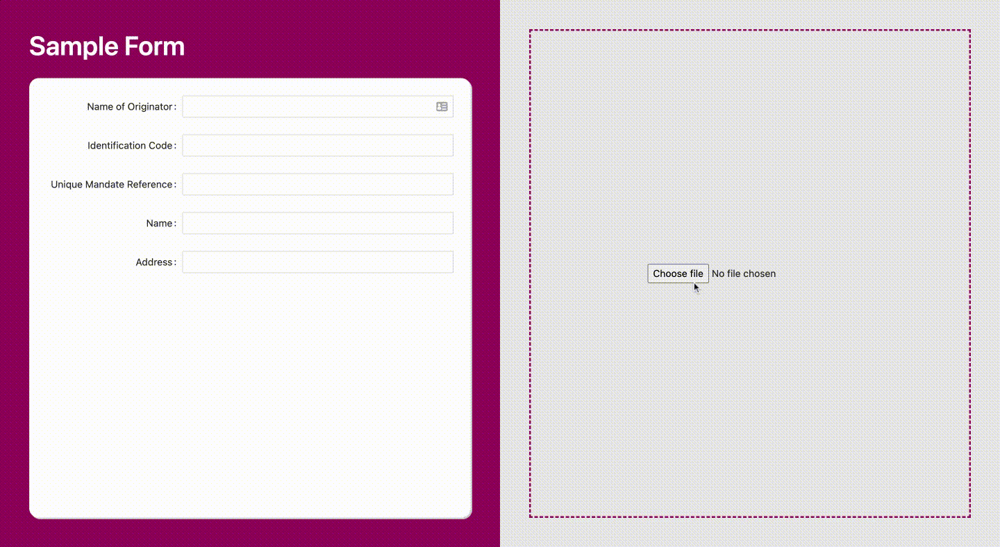

# Papye

A Proof-Of-Concept web application that scans an uploaded image and prefills a set of defined fields on the application.

## :heavy_exclamation_mark: _IMPORTANT_

This application serves only an experimental purpose to showcase what is possible with Form Recognizer from Azure Applied AI Service. Hence, production-level considerations such API security, coding standards and error-handling were not implemented. Do not use this code in production.

## Demo


## Tech Stack


- Front-End:
  - React.js
- Back-End:
  - Node.js

## External Service

- Form Recognizer from Azure Applied AI Service

### Sample form

:file_folder: `client/src/assets/img/`

### Configuration requirement

Add the missing .env files inside the `client` and `api` directories for the following environment variables:

```
PORT
COGNITIVE_SERVICE_ENDPOINT
COGNITIVE_SERVICE_KEY
```

### Dependencies

Navigate to both `client` and `api` directories
and run:

```
npm install
```

### Run :zap:

#### client :computer:

```
npm start
```

#### api :rocket:

```
npm run dev
```
